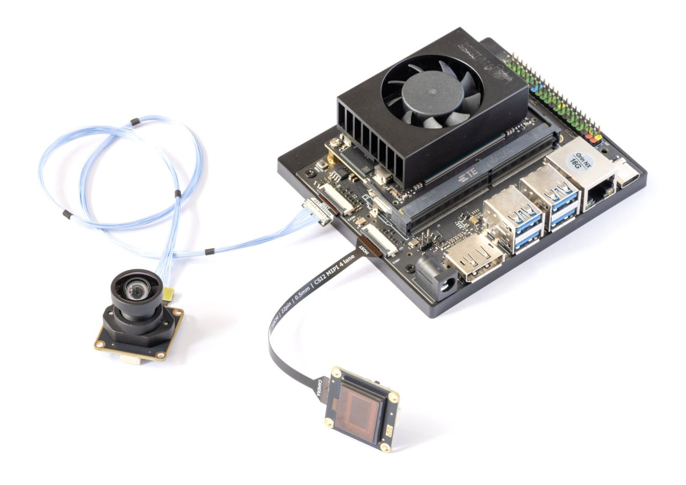
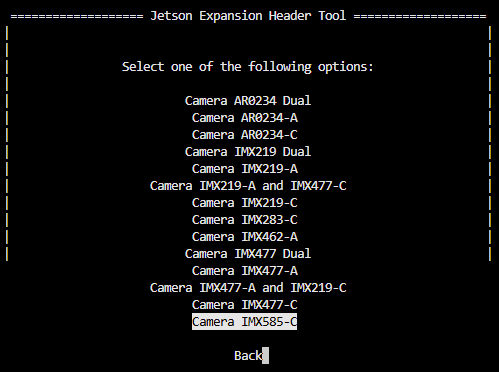
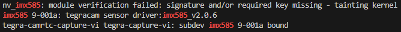

# IMX585 kernel driver for NVIDIA Jetson


NVIDIA Jetson kernel driver for Sony IMX585, an 8.3 MP STARVIS 2 back-side illuminated CMOS sensor optimised for low-light and 4K applications.

- 4-lane MIPI CSI-2
- 12-bit RAW output
- 3856×2180 (full resolution) @ 25 fps
- 1928×1090 (2×2 binned) @ 25 fps

> [!NOTE]
> Bring-up release runs both modes at conservative 720 Mbps/lane, which caps frame rate at 25 fps. Higher link rates, ClearHDR and mono support are planned.



*IMX585 camera modules are available at [kurokesu.com](https://www.kurokesu.com/item/585C-CSI)*

## Setup

Install required tools:

```bash
sudo apt install -y --no-install-recommends dkms
```

Clone this repository:

```bash
cd ~
git clone https://github.com/Kurokesu/imx585-jetson-driver.git
cd imx585-jetson-driver/
```

Run setup script:

```bash
sudo ./setup.sh
```

Setup script:

- Fetches NVIDIA device tree headers required for build
- Builds and installs kernel module via [DKMS](https://github.com/dell/dkms)
- Builds and copies device tree overlay (`.dtbo`) to `/boot`

Use Jetson-IO to configure the CSI connector:

> [!NOTE]
> IMX585 requires 4-lane MIPI CSI, so only port C (`cam1`) is supported.

```bash
sudo /opt/nvidia/jetson-io/jetson-io.py
```

Navigate through the menu:

1. Configure Jetson CSI Connector (named "22pin" on 6.2.2, "24pin" on 6.2.1)
2. Configure for compatible hardware
3. Select `Camera IMX585-C`



4. Save pin changes
5. Save and reboot to reconfigure pins

After reboot, verify sensor is detected:

```bash
sudo dmesg | grep imx585
```



## Image output

| Mode | Resolution | Readout |
| ---- | ---------- | ------- |
| 0 | 3856×2180 | Full native array |
| 1 | 1928×1090 | 2×2 binned |

### GStreamer

```bash
gst-launch-1.0 -e nvarguscamerasrc sensor-id=0 ! \
   'video/x-raw(memory:NVMM),width=3856,height=2180,framerate=25/1' ! \
   queue ! nvvidconv ! queue ! nveglglessink
```

## Test mode

IMX585 has a built-in test pattern generator for verifying data validity.

Enable test pattern:

```bash
# Horizontal color-bar test pattern (test_mode = 5)
echo 5 | sudo tee /sys/module/nv_imx585/parameters/test_mode
```

Turn test pattern off:

```bash
echo 0 | sudo tee /sys/module/nv_imx585/parameters/test_mode
```

| Test pattern code | Description |
| ----------------- | ----------- |
| 0 | Off (normal operation) |
| 1 | All 000h |
| 2 | All FFFh |
| 3 | All 555h |
| 4 | All AAAh |
| 5 | Horizontal color bars |
| 6 | Vertical color bars |

## Development builds

For manual builds without DKMS:

```bash
make              # build everything (dtbo + kernel module)
sudo make install # copy dtbo to /boot, rmmod + insmod
```

> [!NOTE]
> Module is loaded immediately via `insmod` but won't persist across reboots. Use `sudo ./setup.sh` for permanent installation via DKMS.

Individual targets:

```bash
make dtbo      # build only the device tree overlay
make module    # build only the kernel module
make clean     # remove build artifacts
```

Build artifacts are placed in `./build`.
